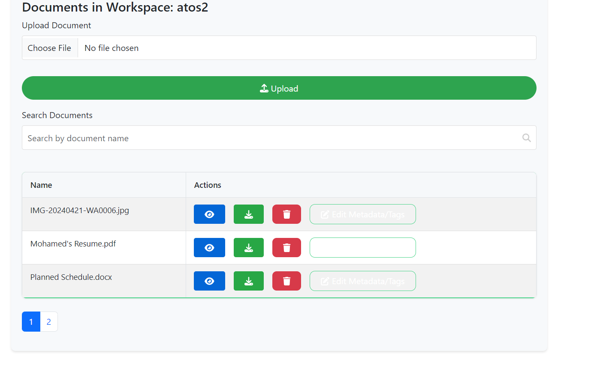
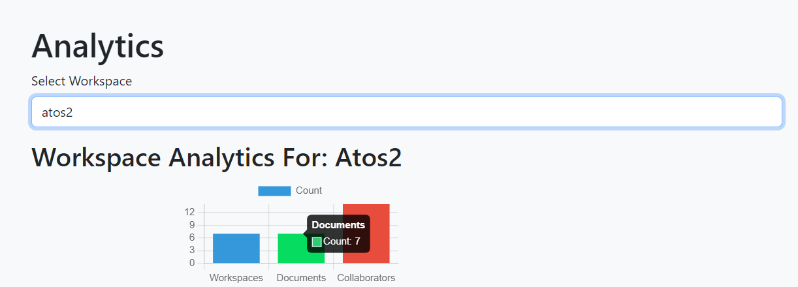
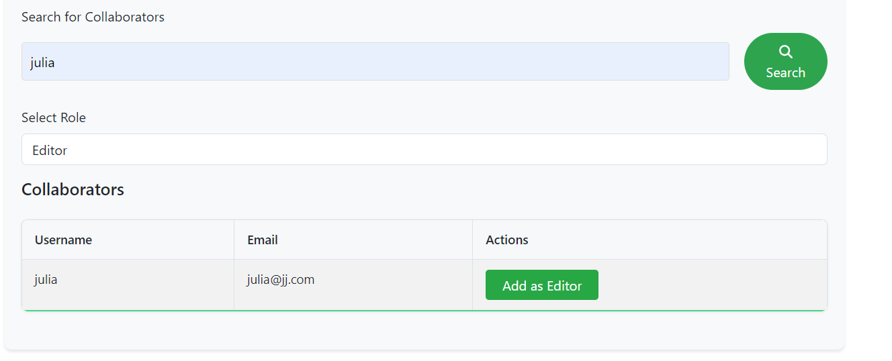
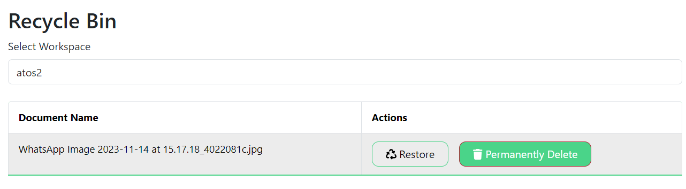

# Atos Task Document Management System 📁  
  

The **Atos Task Document Management System** is a streamlined solution for managing and organizing documents across various projects, ensuring seamless access and collaboration. 🗂️

## Features 📝  
- **Document upload and storage** 📥: Easily upload documents with secure storage.  
- **Metadata management** 🔍: Each document is stored with metadata, ensuring easy searching and filtering.  
- **Secure access controls** 🔒: Implement role-based access to protect sensitive data.  
- **User-friendly interface** 💻: Simple, intuitive UI for managing files and users.  
- **Document versioning** 🗃️: Keep track of document history with version control.

## Technologies Used 🔧  
- **Frontend**: React  
- **Backend**: Node.js, Express.js  
- **Database**: MongoDB  
- **Authentication**: JWT for secure access  

## User Interface & Workflow 🖥️  

### Document Upload  
  

### Document Overview  
  

### Add Collaborator 
  

### Recycle Bin
  

## Installation 🛠️  
1. Clone the repository:  
   ```bash  
   git clone https://github.com/MohamedBoghdaddy/Atos-Task-document-management-system.git  
   ```  
2. Navigate to the project folder:  
   ```bash  
   cd Atos-Task-document-management-system  
   ```  
3. Install dependencies:  
   ```bash  
   npm install  
   ```  
4. Start the application:  
   ```bash  
   npm start  
   ```  
5. Access the application at `http://localhost:3000`.  

## Usage 📂  
After installation, the system can be accessed via `http://localhost:3000`. You can upload, manage, review, and track document versions with ease, ensuring efficient project management.

## Future Enhancements 🚀  
- **Real-time collaboration**: Implementing collaborative editing on documents.  
- **Advanced search**: Enhancing search features with AI-based document categorization.  
- **Notifications**: Adding user notifications for document updates.

## License 📜  
This project is licensed under the MIT License.

